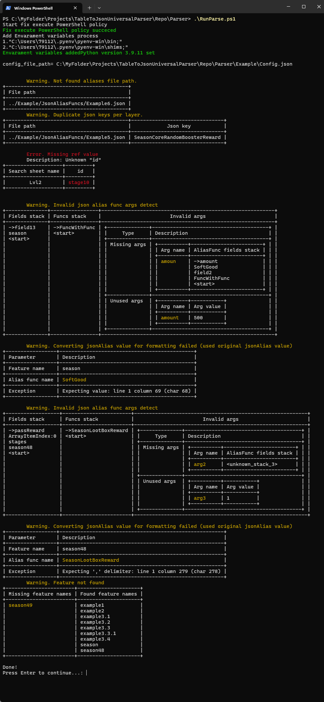

# Описание
TableToJsonUniversalParser - это утили для парсинга табличных данных (excel-файлов, Google Sheets) в текст json-формата с поддержкой неограниченной вложенности объектов json. Утилита написана на языке python.

Особенности:
- Поддерживает парсинг многоуровневой вложенности объектов в json файлах;
- Семантика парсинга настраивается непосредственно в источнике данных;
- Не требует изменения кода при объявлении новых типов;

Поддержка источников данных:
- Excel
- Google Sheets

# Как начать использовать
- Выкачать репозиторий
- Установить с помощью скриптов (см. инструкцию [Instruction.pdf](./Instruction.pdf), раздел "Установка" )
- Ознакомиться с имеющимися примерами(см. файл [/Parser/Example/InstructionExamples.xlsx](./Parser/Example/InstructionExamples.xlsx)) и запустить парсинг (см инструцию [Instruction.pdf](./Instruction.pdf), раздел "Процедура запуска парсинга")
- Изучить правила заполнения семантики (см. инструкцию [Instruction.pdf](./Instruction.pdf), раздел "Правила заполнения семантики парсинга")
- Настроить конфиг парсинга под свои данные ([/Parser/Example/Config.json](./Parser/Example/Config.json)), заполнить семантику и вызвать процедуру парсинга

# FAQ
- Пример заполненной семантики парсинга в GoogleSheets (клонируйте к себе документ, чтобы иметь возможность редактировать) [GoogleSheets документ](https://clc.li/saigor33-github-parser-v0-googlesheets-example)
- Для подключение Google Sheets читайте инструкцию [Activate Google Sheets Instruction.pdf](./Activate%20Google%20Sheets%20Instruction.pdf).
- 

Как выглядят некоторые предупреждения об ошибках
  

